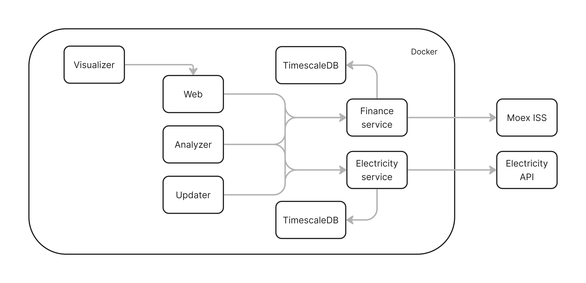

# TimeseriesHSE

Данный проект представляет собой систему анализа и визуализации временных рядов, основанную на применении современных моделей прогнозирования. Проект охватывает два типа данных:

- [Электрические данные (энергопотребление по часам)](https://data.europa.eu/data/datasets/https-free-entryscape-com-store-576-resource-5?locale=en)
- [Финансовые данные (ценовые ряды Московской биржи)](https://iss.moex.com/iss/reference/)

Проект представляет собой систему анализа и визуализации временных рядов, включающую две ключевые части:
1. Исследование и сравнение алгоритмов
2. Построение системы сбора, обработки и визуализации данных

## Исследование и сравнение алгоритмов

На первом этапе было проведено глубокое исследование различных подходов к прогнозированию временных рядов, включая классические регрессионные алгоритмы, нейросетевые модели и трансформеры:
- Анна Барабанова: `CNN`, `Hybrid CNN-LSTM`, `LightGBM`, `NBEATSModel`
- София Касаева: `ARIMA`, `(S)ARIMA(X)`, `RNN/LSTM`, `TFT`
- Анна Русидзе: `GRU`, `XGBoost`, `Prophet`, `Informer`, `Autoformer`

Для каждой модели подбирались оптимальные параметры, анализировалась архитектура, проводилось сравнение по точности и интерпретируемости. Особое внимание было уделено трансформерам (`Informer`, `Autoformer`, `TFT`), как наиболее современным и мощным подходам для анализа временных зависимостей.

## Построение системы с онлайн-прогнозированием

Была спроектирована и построена система на микросервисной архитектуре.
Архитектура состоит из следующих микросервисов:
- Web Service - Frontend, API-шлюз и пользовательский интерфейс.
- Finance Service - Обработка данных акций.
- Electricity Service - Обработка данных цен на электроэнергию
- Analyzer Service - Анализ и прогнозирование данных с помощью ML-моделей
- Updater Service - Автоматическое обновление данных
- Streamlit Service - Интерактивная визуализация результатов
- База данных Finance - TimescaleDB для хранения данных акций
- База данных Electricity - TimescaleDB для хранения данных электроэнергии

Взаимодействие между модулями производится по следующей схеме:


Реализован веб-интерфейс, позволяющий:
- Загружать и обновлять данные
- Строить прогнозы с помощью выбранной модели
- Визуализировать вероятностные предсказания (например, из TFT)

## Запуск приложения

### Запуск локально

#### Загрузка программы

Для загрузки программы необходимо в терминале (для операционных систем `MacOS` и `Linux`) или в `PowerShell` (для операционной системы `Windows`) необходимо прописать команду `git clone https://github.com/zemld/TimeseriesHSE.git`. При успешном выполнении команды будут установлены все программные файлы.
Если `Git` не установлен, то его можно установить так:
- `macOS/Linux`: `brew install git`
    - Если и `brew` не установлен, то выполняем команду в терминале `/bin/bash -c "$(curl -fsSL https://raw.githubusercontent.com/Homebrew/install/HEAD/install.sh)"`
- `Windows`: `https://git-scm.com/downloads/win`

#### Запуск программы

Возможны два варианта запуска программы:
1. Локально
2. На сервере
---

##### Запуск локально
Для запуска программы необходимо приложение `Docker Desktop`. При необходимости их можно установить по ссылке: `https://www.docker.com/get-started/`. После установки `Docker Desktop` необходимо запустить это приложение, в терминале/`PowerShell` перейти в директорию с папкой `TimeseriesHSE` (где была выполнена команда `git clone`) и написать команду `docker-compose up -d --build` и подождать, пока не будет показано сообщение,
похожее на такое:

```
[+] Running 9/9
✔ Network timeserieshse_default Created
✔ Container timeserieshse-finance_db-1 Started
✔ Container timeserieshse-electricity_db-1 Started
✔ Container timeserieshse-finance-1 Started
✔ Container timeserieshse-electricity-1 Started
✔ Container timeserieshse-analyzer-1 Started
✔ Container timeserieshse-updater-1 Started
✔ Container timeserieshse-web-1 Started
✔ Container timeserieshse-streamlit-1 Started
```

**Программа готова к использованию**. Для начала использования нужно в браузере открыть сайт
по адресу `http://localhost:8000/`

---

##### Запуск на сервере
Необходимо в браузере открыть сайт по адресу `http://ithse.ru:1170/`